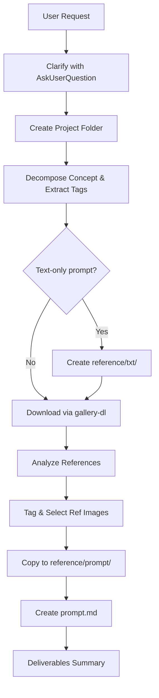

# Image Prompt Generator Skill

Create high-quality image generation prompts through reference research, visual analysis, and downloadable reference images.

## Workflow Overview



## Step-by-Step Instructions

### Step 0: Clarify Requirements with AskUserQuestion

**MANDATORY first step.** Before any other work, use the `AskUserQuestion` tool to ask the user detailed questions and fully clarify the image concept. There is **no limit** on the number of question rounds — continue asking until every important detail is nailed down.

Ask in batches of 2–4 questions per round, covering (but not limited to):

| Round | Example topics |
|-------|---------------|
| 1 | Target generation tool (SD / Midjourney / DALL-E / Flux / NovelAI), art style, time of day / lighting |
| 2 | Camera angle / composition, aspect ratio, key subject details (outfit, expression, pose) |
| 3 | Environment details, props / objects, color tone preferences |
| 4+ | Any remaining ambiguities discovered while reviewing earlier answers |

**Guidelines:**
- If the user provides a reference image, read it first and incorporate what you see into your questions (e.g., "The character in your reference has pink hair and a crown — should we keep / modify these?")
- Phrase each question with concrete options (use the `options` field) so the user can pick quickly, but always allow free-text via the implicit "Other" option
- Do **not** proceed to Step 1 until you are confident every major visual element is specified
- Summarize all confirmed details back to the user before moving on

### Step 1: Create Project Folder

```
[workspace]/[project_name]/
├── reference/
│   ├── txt/      # (Optional) Only if text-only prompt workflow
│   ├── img/      # Downloaded reference images + analysis.md
│   └── prompt/   # Final prompt + selected reference images
```

**Naming**: Descriptive lowercase with underscores (e.g., `ice_mage_scene`, `cyberpunk_city`).

### Step 2: Decompose Image Concept & Extract Keywords

Analyze the user's request into key visual elements:

| Category | Examples |
|----------|----------|
| Art Style | Painterly anime, hyper-detailed 2D, cinematic anime film |
| Subject | Character type, clothing, pose, expression |
| Environment | Ocean, forest, city, sky |
| Effects | Magic circles, particles, lighting, glow |
| Mood | Epic, calm, dark, vibrant |

**Convert natural language to booru tags**:

| Natural Language | Booru Tags |
|------------------|------------|
| "Elf girl casting magic" | `elf`, `pointy_ears`, `casting_spell`, `magic_circle` |
| "Dark portal to void" | `portal`, `dark_background`, `door`, `void` |
| "Holding book" | `book`, `grimoire`, `holding_book` |
| "Silver-white hair" | `white_hair`, `silver_hair`, `long_hair` |

**No Proper Nouns in final prompt output** — use descriptive style terms instead. See [style-replacements.md](references/style-replacements.md) for replacement table. Proper nouns MAY be used during research/search phase only.

### Step 3: (Optional) Text-Only Workflow

**Only if user provides a text-only prompt** (no image concept). Create `.md` files in `reference/txt/` per category with visual characteristics, keywords, and color palettes (hex codes).

Skip if user provides an image concept.

### Step 4: Download Reference Images via gallery-dl

**PRIMARY METHOD**: Download from Danbooru and Gelbooru.

Create multiple search queries covering different aspects:
- Character-focused: `elf+casting_spell`, `white_hair+magic_circle`
- Effect-focused: `magic_circle+glowing`, `portal+dark`
- Composition-focused: `solo+front_view`, `dramatic_lighting`

**Execute downloads** — Replace `{TAGS}` with your search tags. Use `+` to combine tags (e.g., `pink_hair+katana`):

> **Setup**: Before first use, copy `.env.example` to `.env` and fill in your API credentials. See [README.md](../README.md) for details.

```bash
# Load environment variables (Linux/macOS)
export $(grep -v '^#' .env | xargs)

# Danbooru (simple URL format - RECOMMENDED)
# If DANBOORU_API_KEY is set, authenticated requests allow higher rate limits
python -m gallery_dl "https://danbooru.donmai.us/posts?tags={TAGS}" --range 1-15

# Danbooru (authenticated — optional, for higher rate limits)
python -m gallery_dl "https://danbooru.donmai.us/posts?tags={TAGS}&login=${DANBOORU_USERNAME}&api_key=${DANBOORU_API_KEY}" --range 1-15

# Gelbooru (authenticated — recommended for reliable access)
python -m gallery_dl "https://gelbooru.com/index.php?page=post&s=list&tags={TAGS}&api_key=${GELBOORU_API_KEY}&user_id=${GELBOORU_USER_ID}" --range 1-15

# Gelbooru (anonymous fallback — lower rate limits)
python -m gallery_dl "https://gelbooru.com/index.php?page=post&s=list&tags={TAGS}" --range 1-15
```

**Windows users**: Always use `python -m gallery_dl` instead of `gallery-dl` directly.
For loading `.env` on Windows (PowerShell):
```powershell
Get-Content .env | Where-Object { $_ -notmatch '^#' -and $_ -match '=' } | ForEach-Object {
    $k, $v = $_ -split '=', 2
    [System.Environment]::SetEnvironmentVariable($k.Trim(), $v.Trim(), 'Process')
}
```

**Download location**: Images save to subdirectories under current working directory (e.g., `./danbooru/`, `./gelbooru/`). Use `-D reference/img/` to specify output directory if needed.

**Target**: 20-50 images total. Verify with `ls -lh reference/img/` and delete corrupted files (MP4, HTML error pages).

### Step 5: (Optional) Browse via Chrome

**ONLY if explicitly requested by user.** Otherwise skip and rely on gallery-dl.

### Step 6: Analyze References

Create `reference/img/analysis.md`:

1. **Per-image analysis** — source, resolution, relevance (★-★★★★★), visual elements, color palette (hex), composition, key takeaways
2. **Summary comparison table** — compare composition, color, effects, mood across top references
3. **Critical additions beyond references** — elements user requested but NOT in any reference
4. **Reference Image Selection** — see Step 7

### Step 7: Select & Tag Reference Images

Tag each reference image for generation use. See [platform-guide.md](references/platform-guide.md) for full tagging system, platform-specific attachment methods, and selection criteria.

Core tags: `PRIMARY_REF` (always attach), `STYLE_REF`, `EFFECT_REF`, `COLOR_REF`, `COMPOSITION_REF`, `DETAIL_REF`, `DO_NOT_ATTACH`.

### Step 8: Copy Selected References to prompt/

Copy tagged `PRIMARY_REF`, `STYLE_REF`, and `EFFECT_REF` images to `reference/prompt/`:

```bash
cp reference/img/ref01_xxx.jpg reference/prompt/
cp reference/img/ref02_xxx.jpg reference/prompt/
```

Optionally rename for clarity (e.g., `primary_ref.jpg`, `style_ref.png`).

### Step 9: Create Optimized Prompt

Generate `reference/prompt/prompt.md` with **two sections only**:

**1. Main Prompt** — Natural language, detailed, with extensive Markdown headings:

```markdown
## Scene Overview
[Brief summary]

## Character
- **Appearance**: [details]
- **Pose**: [details]
- **Expression**: [details]

## Environment
[details]

## Effects
### Magical Elements
[details]
### Lighting
[details]

## Atmosphere & Mood
[details]

## Technical Details
- Aspect ratio: [value]
- Color palette: [hex codes]
- Key visual elements: [list]
```

**2. Style Keywords** — Categorized: art style, atmosphere, lighting, color palette (hex), technical specs.

**No other sections.** Keep prompt.md focused and clean. **No proper nouns.**

## Critical Rules

1. **No proper nouns in prompts** — See [style-replacements.md](references/style-replacements.md)
2. **Always download references via gallery-dl** — 20-50 images, copy selections to `reference/prompt/`
3. **Always tag references** — Every image gets `PRIMARY_REF`, `EFFECT_REF`, `DO_NOT_ATTACH`, etc.
4. **Verify downloads** — A 4KB "JPEG" is likely an HTML error page

## Troubleshooting

| Problem | Solution |
|---------|----------|
| gallery-dl not found | `pip install gallery-dl` |
| Command not found (Windows) | Always use `python -m gallery_dl` instead of `gallery-dl` directly |
| Danbooru no results | Use simple URL format without authentication options: `python -m gallery_dl "https://danbooru.donmai.us/posts?tags={TAGS}"` |
| Gelbooru 403 | Check `.env` for correct `GELBOORU_API_KEY` and `GELBOORU_USER_ID`. Try anonymous fallback URL if credentials are unavailable |
| `.env` not loaded | Run `export $(grep -v '^#' .env | xargs)` (Linux/macOS) or the PowerShell snippet (Windows) |
| No results for search | Try alternative tags, broader searches, or remove specific tags |
| HTML/error pages downloaded | Verify with `file` command, delete small files (`find reference/img/ -size -10k -delete`) |
| Downloads to wrong location | Check current directory. Use `-D path/to/output/` to specify output directory |

## Quality Checklist

- [ ] Requirements clarified via AskUserQuestion (all major visual elements confirmed)
- [ ] Concept decomposed into searchable keywords
- [ ] gallery-dl downloads from Danbooru + Gelbooru (20-50 images)
- [ ] Downloads verified (correct type, >50KB, no HTML/MP4)
- [ ] analysis.md with per-image analysis + summary table
- [ ] References tagged (`PRIMARY_REF`, `EFFECT_REF`, etc.)
- [ ] Selected references copied to `reference/prompt/`
- [ ] Main prompt with clear MD structure (headings, bullets, tables)
- [ ] **No proper nouns** in prompt output
- [ ] Style keywords with hex codes
- [ ] Final deliverables summary presented
