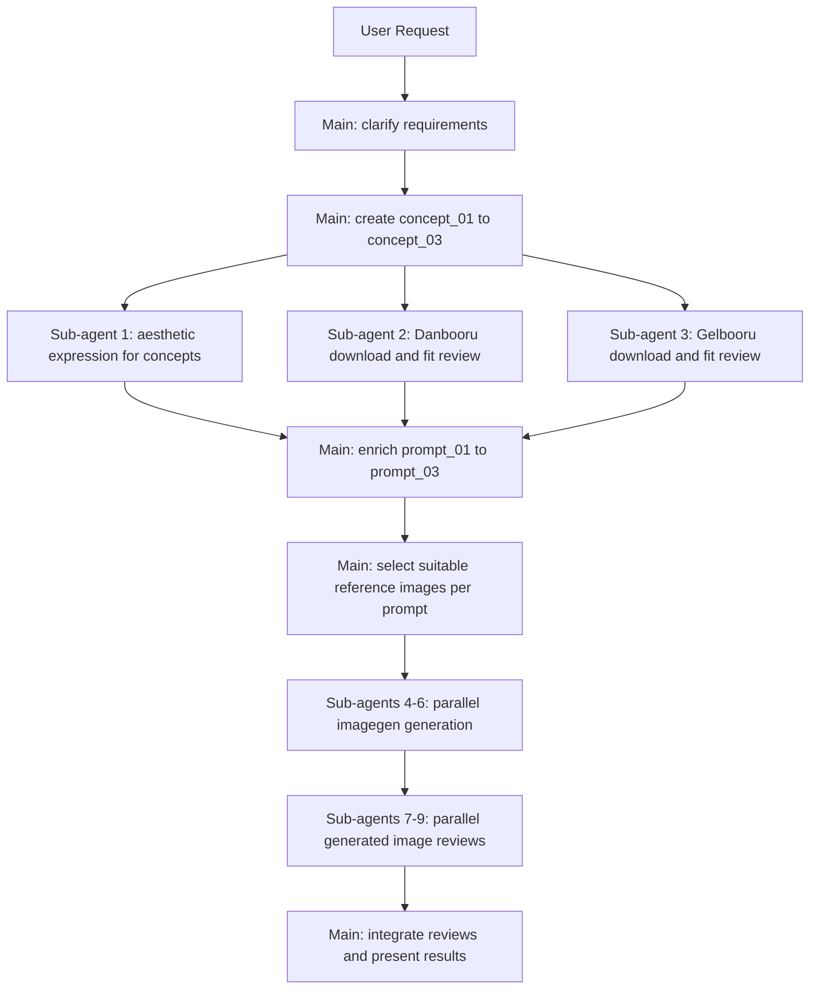

# Image Prompt Generator Skill

Create high-quality image prompts and generated image candidates through Codex orchestration, staged low-reasoning sub-agents, booru reference research, selective reference-image use, and the `imagegen` skill.

## Core Rule: Main Agent Owns Concepts and Final Prompts

The main agent is responsible for:
- Clarifying the user's requirements and success criteria.
- Creating rough concept directions before sub-agent research.
- Reviewing all sub-agent outputs.
- Enriching the rough concepts into final `prompt_01`, `prompt_02`, and `prompt_03`.
- Selecting only suitable reference images for each prompt.
- Writing final prompt files and generation instructions.
- Integrating generated-image reviews and presenting results to the user.

The main agent must not merge all work into one sub-agent. Use separate low-reasoning sub-agents for each stage:
- Sub-agent 1: aesthetic and prompt-expression research for the rough concepts.
- Sub-agent 2: Danbooru-only image download and concept-fit self-review.
- Sub-agent 3: Gelbooru-only image download and concept-fit self-review.
- Sub-agents 4-6: parallel image generation, one prompt per worker.
- Sub-agents 7-9: parallel generated-image review, one prompt result per explorer.

Do not use a prompt-drafting sub-agent. The main agent creates the rough concepts and writes the enriched final prompts.

## Workflow Overview


```mermaid
flowchart TD
    A[User Request] --> B[Main: clarify requirements]
    B --> C[Main: create concept_01 to concept_03]
    C --> D[Sub-agent 1: aesthetic expression for concepts]
    C --> E[Sub-agent 2: Danbooru download and fit review]
    C --> F[Sub-agent 3: Gelbooru download and fit review]
    D --> G[Main: enrich prompt_01 to prompt_03]
    E --> G
    F --> G
    G --> H[Main: select suitable reference images per prompt]
    H --> I[Sub-agents 4-6: parallel imagegen generation]
    I --> J[Sub-agents 7-9: parallel generated image reviews]
    J --> K[Main: integrate reviews and present results]
```

## Required Project Structure

Create a descriptive lowercase project folder in the user's workspace:

```text
[workspace]/[project_name]/
├── reference/
│   ├── img/
│   │   ├── danbooru/          # Danbooru downloads and self-review
│   │   └── gelbooru/          # Gelbooru downloads and self-review
│   ├── prompt/
│   │   ├── prompt_01/
│   │   ├── prompt_02/
│   │   ├── prompt_03/
│   │   └── prompt-index.md
│   └── generated/
│       ├── prompt_01/
│       ├── prompt_02/
│       ├── prompt_03/
│       └── review-summary.md
```

Default to 3 concepts, 3 final prompts, 3 generated images, and 3 generated-image reviews. If the user requests a different count, scale the concept, generation, and review stages to match.

## Step-by-Step Instructions

### Step 0: Main Agent Clarifies Requirements

Ask the user detailed questions until the visual target and success criteria are clear:
- Output use or target generator: Codex image preview, Midjourney, Stable Diffusion, DALL-E, Flux, NovelAI, or other.
- Subject, environment, mood, lighting, aspect ratio, medium, style direction, must-have elements, and avoid items.
- Whether generated images should be produced after prompts are written. Default is yes.
- Any cost, count, or reference-image constraints.

If API credentials are needed for Danbooru/Gelbooru and no `.env` or environment variables are available, the main agent may ask the user how to proceed. Do not ask sub-agents to request secrets from the user.

### Step 1: Main Agent Creates Three Rough Concepts

Before launching research sub-agents, create three rough directions:
- `concept_01`
- `concept_02`
- `concept_03`

Each concept should differ meaningfully in worldbuilding, composition, mood, or visual strategy while still satisfying the user's request. Keep these rough and short; they are inputs for sub-agent research, not final prompts.

Write the concepts into `reference/prompt/prompt-index.md` or pass them directly to sub-agents if files have not been created yet.

### Step 2: Launch Sub-Agent 1 for Aesthetic Expression Research

Launch one low-reasoning `explorer` sub-agent with the `aesthetic-expression-for-concepts` prompt from [subagent-prompts.md](references/subagent-prompts.md).

The sub-agent must evaluate all three concepts and return:
- Aesthetic expression for each concept.
- Prompt language and visual vocabulary.
- Composition choices and the impression each creates.
- Color, light, atmosphere, material, and texture guidance.
- Booru tag/search-query suggestions for each concept.
- Proper-noun-free replacements for final prompt language.

### Step 3: Launch Sub-Agent 2 for Danbooru Download and Fit Review

Launch one low-reasoning `worker` or `explorer` sub-agent with the `danbooru-download-fit-review` prompt from [subagent-prompts.md](references/subagent-prompts.md).

This sub-agent must use Danbooru only. It downloads candidate references, verifies files, and reviews each downloaded image against `concept_01` to `concept_03`.

Before downloading, every Danbooru query must exclude `explicit` and `questionable` ratings at the search stage. Prefer rating-safe/general filters when available, and include negative rating terms such as `-rating:explicit -rating:questionable` in generated queries. Do not knowingly download explicit/questionable results as candidates.

For each valid image, it must record:
- What the image depicts.
- Distinctive features and visually tasteful elements.
- Composition and the impression it creates.
- Color, light, texture, and mood.
- Which concept(s) it fits, if any.
- Whether it should be considered as a reference image candidate.

Save outputs under `reference/img/danbooru/`.

### Step 4: Launch Sub-Agent 3 for Gelbooru Download and Fit Review

Launch one low-reasoning `worker` or `explorer` sub-agent with the `gelbooru-download-fit-review` prompt from [subagent-prompts.md](references/subagent-prompts.md).

This sub-agent must use Gelbooru only. It follows the same fit-review requirements as the Danbooru sub-agent and saves outputs under `reference/img/gelbooru/`.

Before downloading, every Gelbooru query must exclude `explicit` and `questionable` ratings at the search stage. Prefer rating-safe/general filters when available, and include negative rating terms such as `-rating:explicit -rating:questionable` in generated queries. Do not knowingly download explicit/questionable results as candidates.

### Step 5: Main Agent Enriches Final Prompts and Selects References

The main agent integrates Sub-agent 1-3 outputs and writes final prompt directories:
- `reference/prompt/prompt_01/prompt.md`
- `reference/prompt/prompt_02/prompt.md`
- `reference/prompt/prompt_03/prompt.md`

For each prompt:
- Preserve the user's requirements.
- Use the strongest relevant aesthetic and prompt-expression findings.
- Use no proper nouns in final prompt text.
- Decide whether reference images should be used.
- Select only images that fit both the user's request and that prompt's visual direction.
- Do not use all downloaded images by default.
- If no downloaded image is suitable for a prompt, explicitly mark `Reference images: none`.

When selecting reference images:
- Copy only selected images into `reference/prompt/<prompt_id>/`.
- Record each selected image path and role in that prompt's `prompt.md`.
- Use roles such as `PRIMARY_REF`, `STYLE_REF`, `COMPOSITION_REF`, `COLOR_REF`, `EFFECT_REF`, or `DETAIL_REF`.
- State exactly how image-generation sub-agents should attach/use the selected references.

### Step 6: Launch Sub-Agents 4-6 for Parallel Image Generation

Launch three low-reasoning `worker` sub-agents in parallel:
- Sub-agent 4 handles `prompt_01`.
- Sub-agent 5 handles `prompt_02`.
- Sub-agent 6 handles `prompt_03`.

Use the matching prompt template from [subagent-prompts.md](references/subagent-prompts.md):
- `parallel-image-generation-prompt-01`
- `parallel-image-generation-prompt-02`
- `parallel-image-generation-prompt-03`

Each worker must:
- Read and use the `imagegen` skill.
- Use the built-in `image_gen` tool mode unless the user explicitly requested another supported path.
- Generate only its assigned prompt.
- If reference images are listed for the prompt, inspect/load them as needed and attach them as reference images during generation.
- If no reference image is listed, record `Reference images: none` and generate from text only.
- Save every generated image, exact prompt, reference-image list, and generation notes under `reference/generated/<prompt_id>/`.

### Step 7: Launch Sub-Agents 7-9 for Parallel Image Reviews

Launch three low-reasoning `explorer` sub-agents in parallel:
- Sub-agent 7 reviews `prompt_01` outputs.
- Sub-agent 8 reviews `prompt_02` outputs.
- Sub-agent 9 reviews `prompt_03` outputs.

Use the matching prompt template from [subagent-prompts.md](references/subagent-prompts.md):
- `generated-image-review-prompt-01`
- `generated-image-review-prompt-02`
- `generated-image-review-prompt-03`

Each reviewer must evaluate:
- Fit to the user's request.
- Fit to the assigned final prompt.
- Fit to selected reference images, if any.
- Composition and the impression it creates.
- Atmosphere, color, light, texture, technical quality, and artifacts.
- Recommendation: `ACCEPT`, `REJECT`, or `RETRY_ONCE`.

### Step 8: Main Agent Presents Results

The main agent integrates Sub-agent 7-9 reviews.

If at least one image is acceptable:
- Present accepted generated image(s), rejected generated image(s), saved paths, review summaries, and the final prompts.

If no image is acceptable:
- Use the review findings to revise the prompts once.
- Re-run the same three parallel generation workers and three parallel review explorers once.
- Present all generated images and review outcomes even if the retry still fails.

Never hide rejected outputs. Every generated image must be saved locally and reported.

## Final Prompt Format

Each `reference/prompt/<prompt_id>/prompt.md` must contain:

```markdown
# Main Prompt

## Scene Overview
[Brief summary]

## Subject
[Subject details]

## Environment
[Environment details]

## Composition
[Framing, camera angle, focal path, and intended impression]

## Lighting, Color, and Materials
[Lighting, palette hex codes, texture and material details]

## Atmosphere and Mood
[Mood details]

## Technical Details
- Aspect ratio: [value]
- Key visual elements: [list]

# Style Keywords

[Categorized style, atmosphere, lighting, color, and technical keywords]

# Reference Images

- [role]: [path] - [why this image fits this prompt and how to use it]
```

If no reference image fits, write:

```markdown
# Reference Images

Reference images: none
```

## Critical Rules

1. Main creates the rough three concepts before research sub-agents run.
2. Do not use a prompt-draft sub-agent; Main writes final prompts.
3. Danbooru and Gelbooru must be separate sub-agents.
4. Danbooru/Gelbooru sub-agents review each image for fit against `concept_01` to `concept_03`.
5. Danbooru/Gelbooru download queries must exclude `explicit` and `questionable` ratings before download.
6. Reference images are optional and selective; use only images that fit the user request and the assigned prompt.
7. If reference images are selected, generation sub-agents must attach them during image generation.
8. If no reference image fits, generate with text only and record that no references were used.
9. Generate images with the `imagegen` skill after final prompts are written.
10. Run image generation in parallel, one sub-agent per prompt.
11. Run image review in parallel, one sub-agent per prompt result.
12. Save every generated image locally under `reference/generated/<prompt_id>/`, accepted or rejected.
13. No proper nouns in final prompt output. See [style-replacements.md](references/style-replacements.md).

## Quality Checklist

- [ ] Main clarified requirements and success criteria.
- [ ] Main created `concept_01` to `concept_03`.
- [ ] Sub-agent 1 completed aesthetic expression research for all concepts.
- [ ] Sub-agent 2 completed Danbooru download and concept-fit self-review.
- [ ] Sub-agent 3 completed Gelbooru download and concept-fit self-review.
- [ ] Danbooru/Gelbooru queries excluded `explicit` and `questionable` ratings before download.
- [ ] Main wrote final `prompt_01` to `prompt_03`.
- [ ] Main selected only suitable reference images, or marked none.
- [ ] Sub-agents 4-6 generated images in parallel with references attached when present.
- [ ] Sub-agents 7-9 reviewed generated images in parallel.
- [ ] Every generated image was saved and reported.
- [ ] Local and global skill directories were kept in sync after skill edits.
